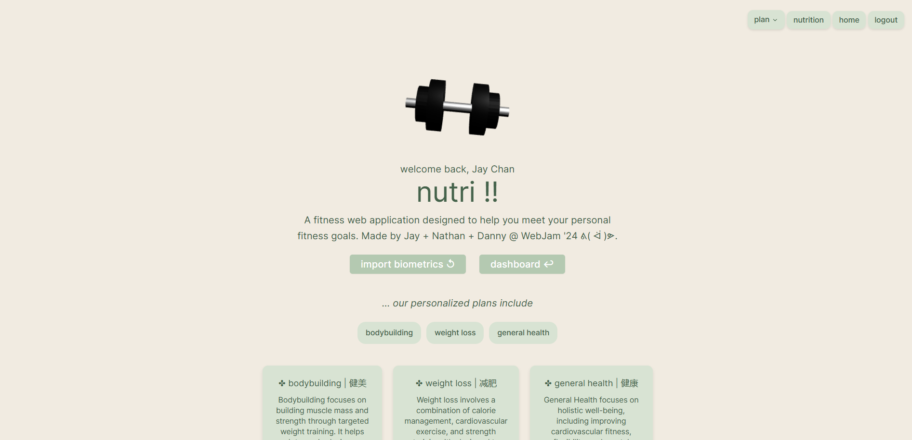

## nutri !!
Developers: Nathan Ong, Jay Chan, Danny Li @ WebJam 2024

Nutri is a fitness webpage designed to help users reach achieve their health and fitness goals by providing personalized tools and resources. Whether you're looking to improve your workout routines, track your nutrition or plan meals, nutri is here to support your fitness journey.

### Features
- Excercise Routines | Workouts: Access a variety of workouts to fit your fitness levels and goals, from strength training to cardio.
- Nutrition Facts | Meal Preparation: Discover healthy eating tips, meal prep ideas, and nutritional information to fuel your body.

### Benefits
- Personalized Fitness Plans: Tailor your workouts and nutrition plans to meet your specific fitness needs.
- Easy-to-use Interact: Designed for simplicity, so you can focus on your progress.
- Track & Improve: Track your fitness and nutrition journey and see results over time.

### Samples

    
    
    
    
    
    

